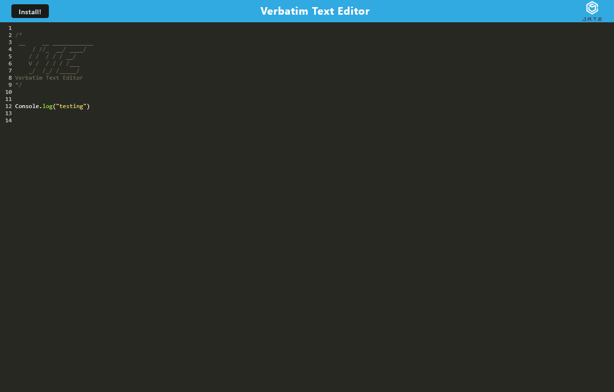

# Verbatim-Text-Editor

## About

This app is an in browser Text Editor that will retain anything typed within. It can also be installed simply by clicking on the Install! button.

You can access this text editor at: https://sheltered-forest-79928.herokuapp.com/

## Instructions

The following is a picture of the single page app:

Any text can be entered into the console style field in black. Anything typed will persist.
Installation can be performed by clicking on the install button on the top left.

## Credits
Heroku for hosting deployment of the app.

## Contact Me

For any questions or additions for this app, contact me at 

https://github.com/Famesmyname/Verbatim-Text-Editor

or email me at edwinfame@yahoo.com

## Version History

1.00    - Release Version, Deployed on Heroku
1.01    - Bug fixed regarding manifest and service worker